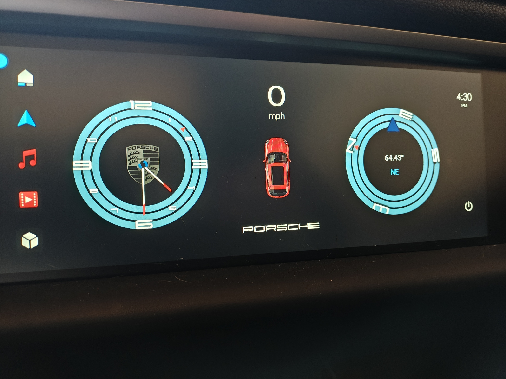
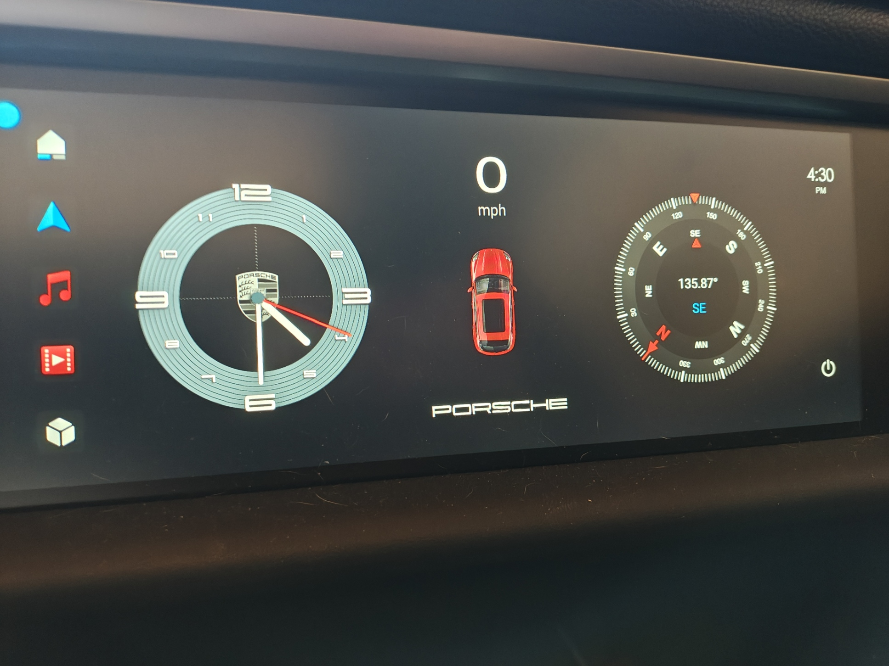
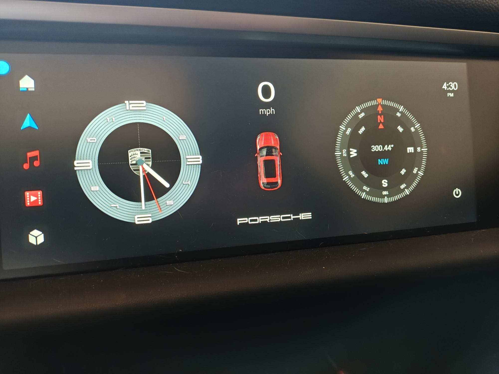
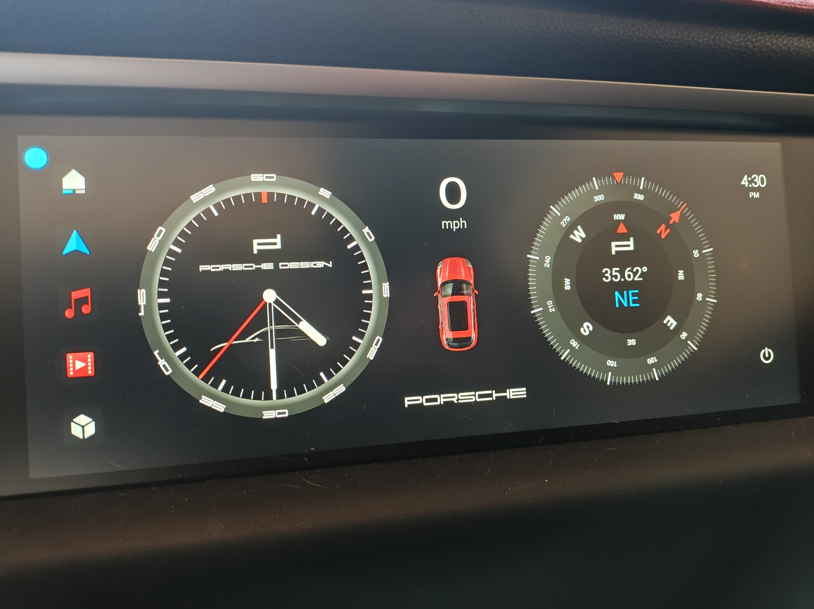
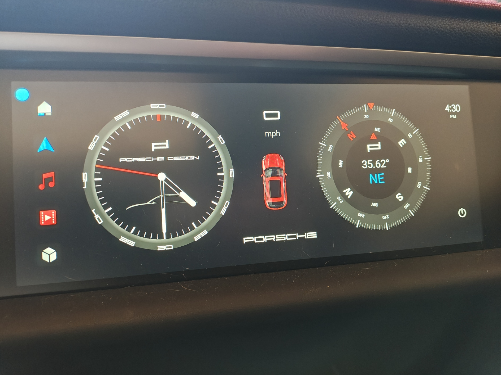
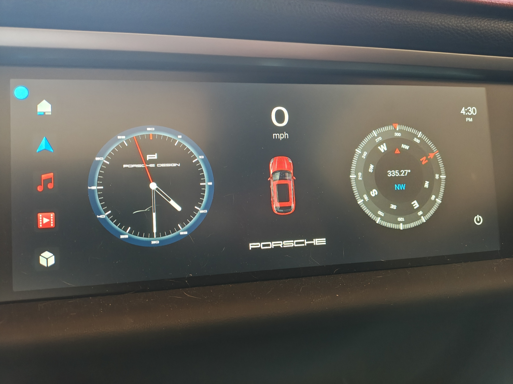
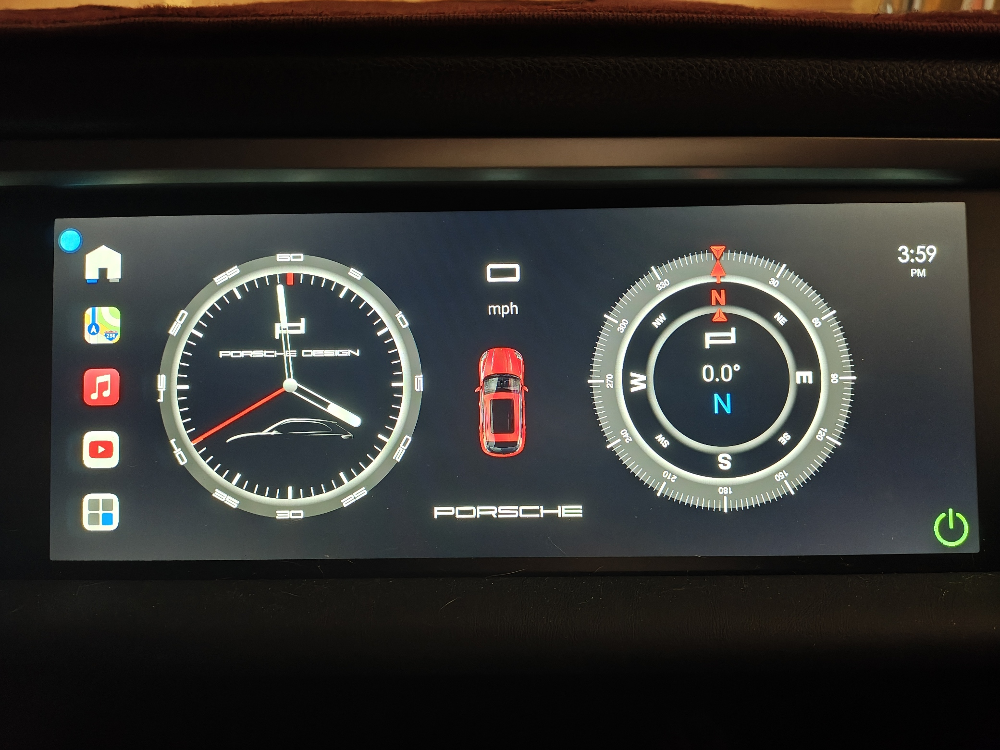

# tsclock

Modded APK for Android Dual Screen MTK Radio

# Special Thanks

Initial modifications to stock files from TorstenH from the XDAForums ([https://xdaforums.com/m/torstenh.11460295/](https://xdaforums.com/m/torstenh.11460295/)) which added Pictures/tsclock.png override of text below center logo.

Also special thanks to [Santrix](https://www.youtube.com/@porscheDIY) for helping with updated graphics.

# Code Signing

By default I am using Google Platform Certificates: [https://android.googlesource.com/platform/build/+/master/target/product/security](https://android.googlesource.com/platform/build/+/master/target/product/security)

If you're building for yourself you should be fine using those.

# Use At Own Risk

Use this at your own risk. While it's doubtful that this can brick your unit, you never know. Backup your current apk and good luck!

# Downloads

## TsClock\_1.0mod\_djbooya\_2.apk

*   Initial Revision based on TorstenH mod adding ability to override default center image.

*   Instructions to customize OEM radio controls: [Santirx Instructional Video](https://www.youtube.com/watch?v=6IumZV3e1j0)
    
*   Add to "Pictures" folder of internal storage a file named "centerlogo.png" to override the default
    
*   Includes TorstenH modificaiton add to "Pictures" folder of internal storage a file named "tsclock.png" to override default wording at bottom center 
    

## TsClock\_1.0mod\_djbooya\_3.apk

*   Different styling 
    

## TsClock\_1.0mod\_djbooya\_4.apk

*   Different styling 
    

## TsClock\_1.0mod\_djbooya\_5.apk

*   Different styling 
    

## TsClock\_1.0mod\_djbooya\_6.apk

*   Different styling, added OEM style font for speed numbers. 
    

## TsClock\_1.0mod\_terry\_1.apk

*   Different styling, just for Terry 
    

## TsClock\_2.0mod\_djbooya.apk

[Download](dist/TsClock_2.0mod_djbooya.apk)

*   NEW VERSION - Support for `buttonMapping.ini`. The format of the file is as follows:  

		btn1pkg:com.ts.MainUI  
		btn1class:com.ts.main.navi.NaviMainActivity  
		btn2pkg:com.ts.dvdplayer  
		btn2class:com.ts.dvdplayer.SDActivity  
		btn3pkg:com.ts.dvdplayer  
		btn3class:com.ts.dvdplayer.USBActivity  
    
* The location of the file belongs in the root of radio where `keyMapping.ini` exists.   
* I use the [AutoMate](https://llamalab.com/automate/) app to get the package name and classname for the button. You'll need to do some trial and error.
    
*   These correspond to the 3 middle buttons on the interface. The defaults are shown above.

## TsClock\_2.0mod\_djbooya_1.apk

*   Different styling, just for Terry 
    
